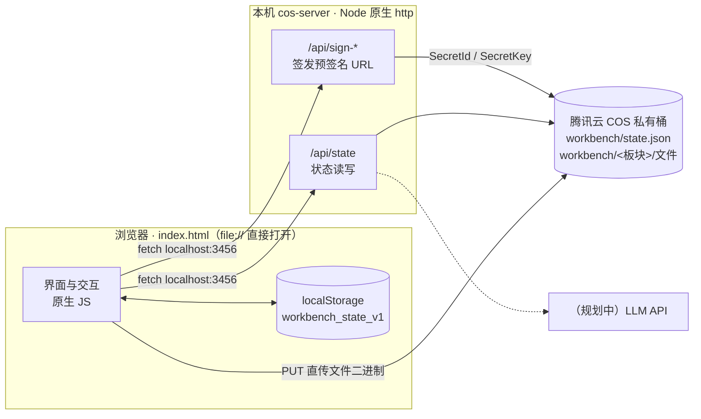

# 个人工作台（Personal Workbench）

一个**零构建、单文件**的本地个人工作台：把备忘录、周计划、月计划、共享文件收纳在一页里，数据本地优先、可跨设备同步到腾讯云 COS。

打开 `index.html` 就能用，没有框架、没有打包、没有依赖安装。

---

## 一、功能一览

### 1. 个人资料卡
姓名 / 英文名 / 部门 / 岗位，点击「✎ 编辑」随时修改，头像取姓名首字母。

### 2. 工作概览
侧边栏实时统计三个数字：**待办**、**已完成**（含历史归档中的项）、**共享文件**。

### 3. 三合一计划卡（备忘录 / 本周计划 / 本月计划）
顶部 Tab 切换，每类都支持添加、勾选完成、删除：

- 勾选完成时记录 `completedAt` 时间戳（精确到分钟），列表里显示为完成时间标签
- 分为「未完成」和「已完成」两区，已完成项带删除线

### 4. 已完成任务的自动归档与折叠（本周 / 本月）

这是工作台的核心机制，避免「已完成」列表无限膨胀：

| 维度 | 归档时机 | 分组标签 | 归档位置 |
|---|---|---|---|
| 本周计划 | 跨周（每周一 00:00 起算新一周） | `2026-W38`（ISO 周） | 卡片底部「历史归档（按周折叠）」 |
| 本月计划 | 跨月（每月 1 日 00:00 起算新一月） | `2026-09` | 卡片底部「历史归档（按月折叠）」 |

- 打开页面时自动执行，**幂等**——重复刷新不会产生重复归档，从云端同步回旧数据后也会重新归档
- 归档依据是任务的 `completedAt`（而不是刷新时刻）
- 每组独立折叠：组头显示周/月标签、`完成 N 项` 计数、日期区间，点击即可展开收起
- **默认展开最近 2 组**，更早的收起；折叠状态只是页面级 UI 状态，不写入数据、不参与云同步

### 5. 共享工作区
按「板块」组织文件（默认 3 个板块，可新增 / 重命名 / 删除）：

- 选择本地文件加入板块，标记为「待上传」
- 勾选后批量上传到 COS（**预签名 URL 直传，密钥不经过浏览器**）
- 已上传的文件标记「已同步」，勾选框自动变灰避免重复上传
- 支持下载（云端走签名 URL，本地走 objectURL）和删除（本地列表 + 云端对象一起删）
- 每个板块底部显示「N 个待上传 · M 个已同步」

### 6. 数据本地优先 + 云端同步
- 所有操作即时写入浏览器 `localStorage`，断网也照常用
- 改动后 **1.5 秒防抖**推送到云端 `state.json`
- 打开页面时拉取云端状态，**云端更新时间戳更新则覆盖本地**（last-write-wins）

---

## 二、技术架构

### 总体结构



### 设计要点

- **密钥永不下发前端**：浏览器只拿得到「10 分钟有效的预签名 URL」，`SecretId` / `SecretKey` 只在本地 Node 进程里，存放在 `.env`（不进 git）
- **前端零依赖**：`index.html` 单文件承载全部 HTML + CSS + JS，不引入任何框架或 CDN 资源，双击即用、断网可用
- **服务端零框架**：只用 Node 内置 `http` / `url` / `path` 模块，唯一的第三方依赖是 `cos-nodejs-sdk-v5`
- **降级友好**：未配置 `.env` 时服务以「开发模式」启动，接口照常响应但签名返回 mock 地址，前端可独立调试

### 技术选型

| 层 | 选型 | 原因 |
|---|---|---|
| 前端 | 原生 JS + CSS 变量 | 单文件分发，无构建链，改完刷新即生效 |
| 本地存储 | localStorage | 本地优先，无后端也能用 |
| 云同步 | COS `state.json` | 已有 COS 桶可直接复用；last-write-wins 足够简单 |
| 文件存储 | COS 私有桶 + 预签名 URL | 前端不接触密钥，私有桶也能安全上传下载 |
| 服务端 | Node 内置 `http` | 需求只有几个接口，引入框架反而增加维护面 |

### 目录结构

```
personal-workbench/
├── index.html              # 单文件前端：界面 + 样式 + 逻辑
├── cos-server/
│   ├── server.js           # 本地签名服务（签发 URL / 状态同步 / 文件删除）
│   ├── package.json        # 唯一依赖：cos-nodejs-sdk-v5
│   ├── .env.example        # 配置模板（复制为 .env 后填密钥）
│   └── .gitignore          # 排除 .env / server.log / node_modules
└── README.md
```

### 服务端接口

| 方法 | 路径 | 作用 |
|---|---|---|
| GET | `/health` | 健康检查，返回 `{ ok: true }` |
| GET / POST | `/api/sign-upload?filename=&folder=` | 签发预签名 **PUT** URL（10 分钟有效），供前端直传 |
| GET | `/api/sign-download?key=` | 签发预签名 **GET** URL，私有桶下载 |
| GET / POST | `/api/delete?key=` | 删除 COS 对象 |
| GET | `/api/state` | 读取云端 `state.json`，不存在返回 `null` |
| POST / PUT | `/api/state` | 写入云端 `state.json` |

所有接口带 CORS 头，允许 `file://` 页面直接调用。

### 数据模型

```jsonc
{
  "profile": { "name": "", "en": "", "dept": "", "job": "" },
  "tasks": {
    "memo":  { "active": [], "done": [] },
    "week":  {
      "active": [], "done": [],
      "history": [                       // 自动归档（按周）
        { "label": "2026-W38", "start": 1757520000000,
          "items": [ { "id": "…", "text": "…", "completedAt": 1757500000000 } ] }
      ]
    },
    "month": { "active": [], "done": [], "history": [] }   // 自动归档（按月）
  },
  "boards": [
    { "id": "b1", "name": "板块一",
      "files": [ { "id": "…", "name": "报告.pdf", "size": 102400,
                   "serverUploaded": true, "objectKey": "workbench/b1/…" } ] }
  ],
  "updatedAt": 1757500000000          // 云同步用的版本时间戳
}
```

浏览器本地键：`workbench_state_v1`（主数据）、`workbench_last`（最后修改时间）、`workbench_lastpush`（最后推送时间）。

---

## 三、快速开始

### 1. 安装依赖

```bash
cd cos-server
npm install
```

### 2. 配置密钥

```bash
cp .env.example .env
# 编辑 .env，填入 COS_SECRET_ID / COS_SECRET_KEY / COS_BUCKET
```

`.env` 已在 `.gitignore` 中排除，代码里不保存任何密钥。

### 3. 启动签名服务

需 Node ≥ 20.6（`--env-file` 的版本要求）：

```bash
cd cos-server
node --env-file=.env server.js
```

启动成功会打印 `✔ 已配置真实密钥，签名接口将真正对接 COS 桶 …`。
若显示「开发模式」，说明 `.env` 没被加载或字段为空——此时接口可用，但签名返回 mock 地址，不会真正上传。

> 想双击启动的话，可以在工作台目录放一个 `.command` 脚本，内容为
> `cd cos-server && node --env-file=.env server.js`，再 `chmod +x` 即可。

### 4. 打开工作台

浏览器打开 `index.html` 即可。建议固定用同一个浏览器（数据在 localStorage，换浏览器相当于换一份本地数据，云端同步会把数据拉回来）。

---

## 四、安全说明

- `index.html` 中**不含任何密钥**，`server.js` 也不含——密钥只在 `.env` 里
- 上游仓库中所有敏感值均已替换为占位符，请使用自己的密钥对
- 签名服务仅监听本机（`localhost:3456`），但**没有鉴权**：请勿把端口暴露到公网，也勿将 `server.js` 部署到公网环境
- 若你的密钥曾以明文形式出现在代码、聊天记录或备份中，建议到腾讯云控制台【访问管理 > API 密钥管理】轮换一次

---

## 五、已知限制与后续规划

**限制**
- 文件二进制不落 localStorage：刷新后「待上传」的本地文件需要重新选择（已上传到 COS 的不受影响）
- 云同步为 last-write-wins，多设备同时编辑可能互相覆盖，不适合高频并发场景

**规划**
- 一键生成周报 / 月报：由 `cos-server` 代理调用大模型（密钥同样走 `.env`），把本周 / 本月的已完成任务加工成结构化汇报
